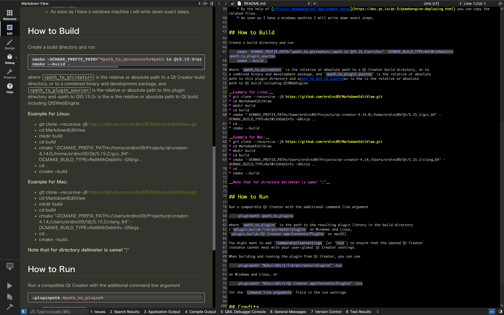
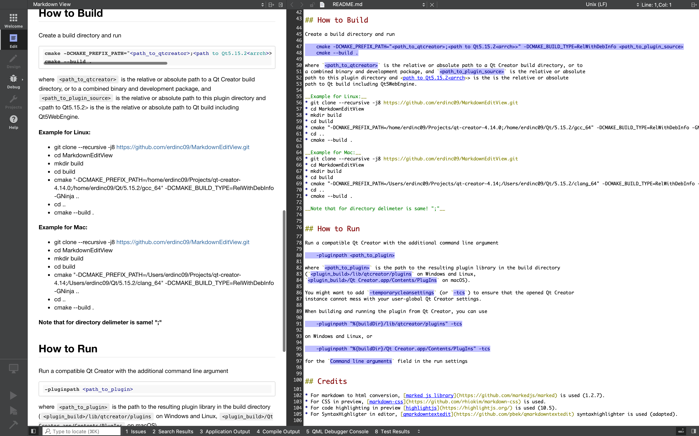

# MarkdownEditView
Qt Creator IDE markdown plugin, for both editing and previewing the file in html.

__Features:__

* Syntax highlighting in editor
* Html preview
* Code highlighting in preview
* Theme aware preview and editor
* Bidirectional vertical sroll synchronization between editor and preview

__Dark Theme Screen Shot:__

__Classic Theme Screen Shot:__

## How To Install

* For Linux, MacOs and Windows you can download the plugin from [releases](https://github.com/erdinc09/MarkdownEditView/releases).
* Since QtCreator is not packaged with qtwebengine, you need to install following dependencies from qt installation to qtcreator (qtcreator that MarkdownEditView will be installed!) directory. This process will be automatized later by the plugin.
  * Qt5.15.2 must be installed with QtWebEngine dependency (we will copy the dependencies from here).
  * For __linux:__  
    * copy  `<Qt Installation Path>`/5.15.2/gcc_64/lib/libQt5WebChannel.so*       to `<Ct Creator Ins Path>`/lib/Qt/lib  
    * copy  `<Qt Installation Path>`/5.15.2/gcc_64/lib/libQt5WebEngine.so*        to `<Ct Creator Ins Path>`/lib/Qt/lib
    * copy  `<Qt Installation Path>`/5.15.2/gcc_64/lib/libQt5WebEngineCore.so*    to `<Ct Creator Ins Path>`/lib/Qt/lib
    * copy  `<Qt Installation Path>`/5.15.2/gcc_64/lib/libQt5WebEngineWidgets.so* to `<Ct Creator Ins Path>`/lib/Qt/lib
    * check the symbolink links, when I checked they were all relative
    * copy  `<Qt Installation Path>`/5.15.2/gcc_64/libexec        to `<Ct Creator Ins Path>`/lib/Qt/
    * copy  `<Qt Installation Path>`/5.15.2/gcc_64/resources      to `<Ct Creator Ins Path>`/lib/Qt/
    * copy  `<Qt Installation Path>`/5.15.2/gcc_64/translations   to `<Ct Creator Ins Path>`/lib/Qt/
  
Not: Actually for resource, libexec and translations folders only the related files should be copied. But just now, copy all files. I will update later.

  * For __macos:__
    * This is easier than linux. All resource and configuratin files are kept together.
    * copy  `<Qt Installation Path`>/5.15.2/clang_64/lib/QtWebChannel.framework           to  `<Qt Creator.app`>/Contents/Frameworks/
    * copy  `<Qt Installation Path`>/5.15.2/clang_64/lib/QtWebEngine.framework            to  `<Qt Creator.app`>/Contents/Frameworks/
    * copy  `<Qt Installation Path`>/5.15.2/clang_64/lib/QtWebEngineCore.framework        to  `<Qt Creator.app`>/Contents/Frameworks/
    * copy  `<Qt Installation Path`>/5.15.2/clang_64/lib/QtWebEngineWidgets.framework     to  `<Qt Creator.app`>/Contents/Frameworks/
  * For __windows:__
    * Since I do not have Windows machine I cannot write the exact steps but the logic same.
    * By the help of [official qtwebengine5 deployment notes](https://doc.qt.io/qt-5/qtwebengine-deploying.html) you can copy the related files.
    * As soon as I have a windows machine I will write down exact steps.

## How to Build

* Install Qt 5.15.2 with Qt5WebEngine.
* Follow command below:

__Example for Linux:__

first, get qt-crator and build it:

* git clone https://github.com/qt-creator/qt-creator.git
* cd ./qt-creator
* git checkout v4.15.2
* mkdir qtcreator_build
* cd qtcreator_build
* cmake -DCMAKE_BUILD_TYPE=Debug -G Ninja "-DCMAKE_PREFIX_PATH=/home/erdinc09/Qt/5.15.2/clang_64" ..

then, get MarkdownEditView and build it:

* git clone --recursive -j8 https://github.com/erdinc09/MarkdownEditView.git
* cd MarkdownEditView
* mkdir build
* cd build
* cmake "-DCMAKE_PREFIX_PATH=/home/erdinc09/git/qt-creator/qtcreator_build;/home/erdinc09/Qt/5.15.2/gcc_64" -DCMAKE_BUILD_TYPE=RelWithDebInfo -GNinja ..
* cd ..
* cmake --build .

__Example for Mac:__

first, get qt-crator and build it:

* git clone https://github.com/qt-creator/qt-creator.git
* cd ./qt-creator
* git checkout v4.15.2
* mkdir qtcreator_build
* cd qtcreator_build
* cmake -DCMAKE_BUILD_TYPE=Debug -G Ninja "-DCMAKE_PREFIX_PATH=/Users/erdinc09/Qt/5.15.2/clang_64" ..
* cmake --build .

then, get MarkdownEditView and build it:

* git clone --recursive -j8 https://github.com/erdinc09/MarkdownEditView.git
* cd MarkdownEditView
* mkdir build
* cd build
* cmake "-DCMAKE_PREFIX_PATH=/Users/erdinc09/git/qt-creator/qtcreator_build;/Users/erdinc09/Qt/5.15.2/clang_64" -DCMAKE_BUILD_TYPE=RelWithDebInfo -GNinja ..
* cd ..
* cmake --build .

__Note that for directory delimeter is same! ";"__

## How to Run

Run a compatible Qt Creator with the additional command line argument

    -pluginpath <path_to_plugin>

where `<path_to_plugin>` is the path to the resulting plugin library in the build directory
(`<plugin_build>/lib/qtcreator/plugins` on Windows and Linux,
`<plugin_build>/Qt Creator.app/Contents/PlugIns` on macOS).

You might want to add `-temporarycleansettings` (or `-tcs`) to ensure that the opened Qt Creator
instance cannot mess with your user-global Qt Creator settings.

When building and running the plugin from Qt Creator, you can use

    -pluginpath "%{buildDir}/lib/qtcreator/plugins" -tcs

on Windows and Linux, or

    -pluginpath "%{buildDir}/Qt Creator.app/Contents/PlugIns" -tcs

for the `Command line arguments` field in the run settings

## Credits

* For markdown to html conversion, [marked js library fork](https://github.com/erdinc09/marked) is used (adapted).
* For CSS in preview, [markdown-css](https://github.com/rhiokim/markdown-css) is used.
* For code highlighting in preview [highlightjs](https://highlightjs.org/) is used (10.5).
* For SyntaxHighligter in editor, [qmarkdowntextedit](https://github.com/pbek/qmarkdowntextedit) syntaxhighlighter is used (adapted).
